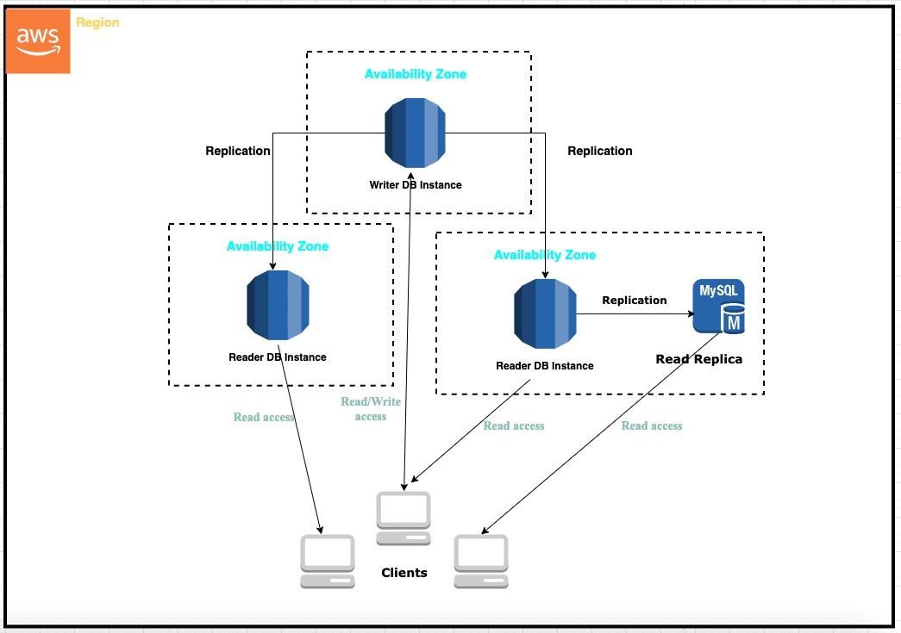

# MYSQL RDS CLUSTER

This repository contains terraform code for a mysql rds cluster that will be deployed as a Multi-AZ DB cluster.

Multi-AZ deployment have enhanced database durability and availability. The increased availability and fault tolerance offered by Multi-AZ deployments make them a great fit for a highly available e-commerce website they have the added advantage that DB instance failover is automatic and requires no administration.

Running work loads in a Multi-AZ deployment safeguards your data in the unlikely event of a DB instance component failure or loss of availability in one Availability Zone making it a great fit for a high profile e-commerce website.

This module is also configured to optionally provision a read replica mysql db instance with the Multi-AZ DB cluster as its "source". The read replica serves to improves read traffic scalability for a cluster of ec2 instances. 

## High level architecture of Multi-AZ DB Cluster



## Deployment Procedure

To deploy the mysql RDS cluster, do the following:

1. Install Terraform. For instructions and a video tutorial, see [Install Terraform](https://learn.hashicorp.com/tutorials/terraform/install-cli).
   
2. [Install](https://docs.aws.amazon.com/cli/latest/userguide/install-cliv2.html) and [configure](https://docs.aws.amazon.com/cli/latest/userguide/cli-configure-quickstart.html) the AWS Command Line Interface (AWS CLI).

3. If you don't have git installed, [install git](https://git-scm.com/book/en/v2/Getting-Started-Installing-Git).

4. Clone this repository using the following command:

   `git clone https://github.com/louis-ng/terraform-mysql-rds-cluster.git`

5. Change directory to the root repository directory.

   `cd terraform-mysql-rds-cluster/live/`

6. Workflow for new deployment

    Let’s get started by pulling the GitHub Terraform modules for deploying the Multi-AZ DB cluster.

   Note: This deployment assumes that are deploying the rds cluster into an existing VPC.
    1. Update the demo.tfvars file in the tfvars/ folder to set values for variables defined in the variables.tf file and save your changes.

    2. Initialise the terraform configuration
        ```
        terraform init
        ```
    3. Validate your terraform configuration
        ```
        terraform validate
        ```
    4. Run terraform plan to inspect changes to be deployed 
        ```
        terraform plan --var-file=tfvars/demo.tfvars
        ```
    5. Apply your terraform configuration changes and approve
        ```
        terraform apply --var-file=tfvars/demo.tfvars
        ```

8.  Clean Up

      Some of the AWS resources created by the Terraform RDS Multi-AZ instance and cluster modules incur costs as long as they are in use. When you no longer need the resources, clean them up by deleting the Multi-AZ cluster with the VPCs as follows. Run the following commands in your terminal window
      ```
        cd terraform-mysql-rds-cluster/live/
        terraform destroy --var-file=tfvars/demo.tfvars
      ```
        
